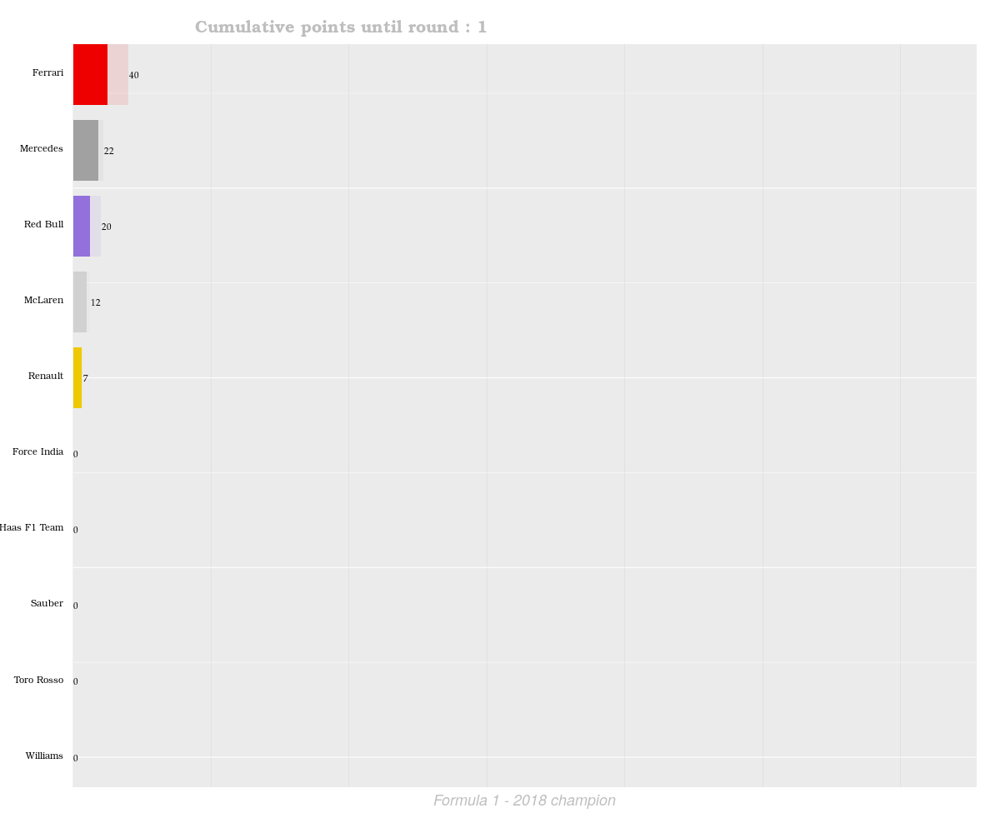

# formula1_animated_barchart

This project was part of Statistical Programming course - UoE - Master in Optimization with Data Science 2019.

I upload it here as it can be used as driver for plotting annimated bar charts, with additional information inside each bar (in our case the individual drivers of Formula 1 Teams) 

**Disclaimer:** The code used for the project is highly inspired from [https://github.com/amrrs/animated_bar_charts_in_R](this) github repo. The main idea is completely the same apart from the added information inside the bar charts.

